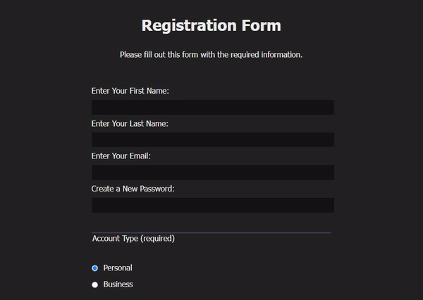

# Registration Form
Signup web-page using front-end html/css for collecting and managing form submission from user input. Uses form, fieldsets, various inputs and their attributes: for, id, name, etc. This exercise is apart of the lesson plan from Free Code Camp's ["Responsive Web Design"](https://www.freecodecamp.org/learn/2022/responsive-web-design/) course.

## Technologies
- HTML5: forms elements, label elemetns nesting inputs elements and connecting them using for, id, and name attributes.
- CSS3: Styling the form margins and colors, input field sizes and colors, and target styles by html attributes. 

## Future Features
Simplify the form sign up as one module. Include quick sign up with google or other services. 

## Existing Prototype

